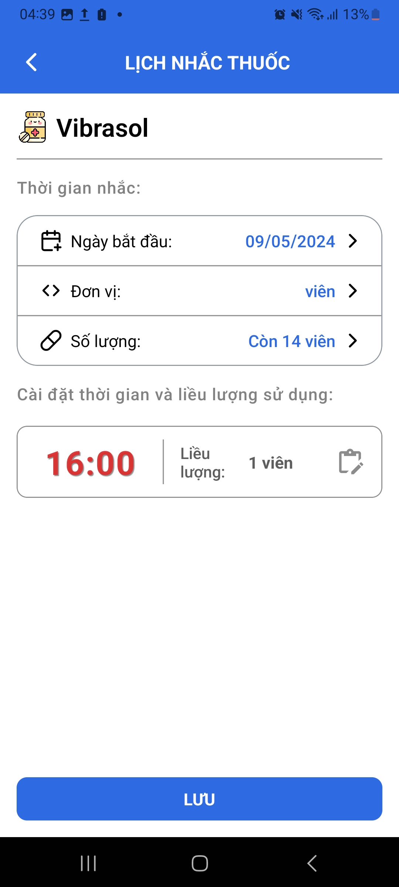

# Xây dựng hệ thống quản lý bệnh viện

## Thành viên nhóm:

| STT | Họ tên               |   MSSV   |
| :-: | -------------------- | :------: |
|  1  | Nguyễn Minh Tú       | 20110741 |
|  2  | Nguyễn Quốc Bảo      | 20110179 |
|  3  | Nguyễn Ngọc Tuyết Vi | 20110748 |

## Các công cụ và công nghệ được sử dụng

- Ngôn ngữ lập trình: Java, JavaScript
- IDE/ Text Editor: IntelliJ IDEA Ultimate, Visual Studio Code
- Database: Microsoft SQL Server
- Back-end: Java Spring Boot
- Front-end: ReactJS, React Native

## Những tính năng chính

| Người dùng       | Chức năng                                                                                                                                                                                                                                                                                                                                                                                                                                                                                                                                                                                                                                                                                                                                 |
| ---------------- | ----------------------------------------------------------------------------------------------------------------------------------------------------------------------------------------------------------------------------------------------------------------------------------------------------------------------------------------------------------------------------------------------------------------------------------------------------------------------------------------------------------------------------------------------------------------------------------------------------------------------------------------------------------------------------------------------------------------------------------------- |
| Người dùng khách | - Đăng nhập bằng số điện thoại.   - Đăng ký tài khoản bệnh nhân.   - Quên mật khẩu.                                                                                                                                                                                                                                                                                                                                                                                                                                                                                                                                                                                                                                                 |
| Bệnh nhân        | - Đăng xuất.   - Tạo hồ sơ bệnh nhân.   - Xem thông tin hồ sơ bệnh nhân.   - Chỉnh sửa thông tin hồ sơ bệnh nhân.   - Xóa hồ sơ bệnh nhân.   - Tìm hồ sơ bệnh nhân đã mất.   - Xem phiếu khám bệnh của hồ sơ bệnh nhân.   - Đặt lịch khám bệnh.   - Xem lịch sử khám chữa bệnh.   - Tra cứu kết quả xét nghiệm.   - Chat với tư vấn viên.   - Thanh toán viện phí.   - Đặt lịch nhắc thuốc.                                                                                                                                                                                                                                                                                                           |
| Quản lý          | - Đăng xuất.   - Thực hiện thống kê doanh thu, lượt đặt khám, phương thức thanh toán, bệnh nhân, các khoa có nhiều lượt khám nhất, số lượng bệnh nhân, số khoa.   - Xem danh sách các bệnh nhân và thông tin chi tiết của bệnh nhân.   - Xem danh sách các thanh toán và thông tin chi tiết của thanh toán.   - Quản lý nhân viên: Thêm, sửa, khóa, mở khóa nhân viên, xem thông tin của nhân viên.   - Quản lý khoa: Tìm kiếm, thêm, sửa, khóa, mở khóa khoa, thêm hoặc xóa bác sĩ khỏi khoa, thêm hoặc xóa trưởng khoa.   - Quản lý phòng: Tìm kiếm thêm, sửa, khóa, mở khóa phòng.   - Quản lý dịch vụ: Tìm kiếm thêm, sửa, khóa, mở khóa dịch vụ.   - Quản lý thuốc: Tìm kiếm thêm, sửa, khóa, mở khóa thuốc. |

## Urls

1. [Font-end (web) deploy với Firebase](https://the-duck-hospital.web.app/)
2. [Diagrams (Class Diagram, Sequence Diagram, Activity Diagram, Use Cases)](https://app.diagrams.net/#G1Wsjw0nT924APhNPSe_pyxop5M0Kck5tE)
3. [File báo cáo](https://minhtunguyen-my.sharepoint.com/:w:/g/personal/baobao_minhtunguyen_onmicrosoft_com/Ef6XF8Eh_D1DueTpRPFfSvYBSujaRHg_bLJmuiJ5qo5coQ?e=1XhIym)
4. [Github](https://github.com/MinhTuMTN/TheDuckHospital)
5. [Test case](https://minhtunguyen-my.sharepoint.com/:x:/g/personal/tuyetvi_minhtunguyen_onmicrosoft_com/Ebibym9lZ6FOo2lzRCIy3BEB-hj1H5nBzu9snPC3-TR8vQ?e=7nwyzc)
6. [Automation test code](https://github.com/MinhTuMTN/TheDuckHospital/tree/main/automation-test)
7. [Video demo](https://minhtunguyen-my.sharepoint.com/:v:/g/personal/admin_minhtunguyen_onmicrosoft_com/EYm0k_BFIAtPt15zGWi3wDoBkQOCJooHPKp8nHQmkPVMPQ)
8. [Video demo - Mobile - P1](https://minhtunguyen-my.sharepoint.com/:v:/g/personal/admin_minhtunguyen_onmicrosoft_com/EUboRo8WCaxDnfXJJ5UqSkYBDkK5JGGutWrBEbw9hJZs8A?nav=eyJyZWZlcnJhbEluZm8iOnsicmVmZXJyYWxBcHAiOiJPbmVEcml2ZUZvckJ1c2luZXNzIiwicmVmZXJyYWxBcHBQbGF0Zm9ybSI6IldlYiIsInJlZmVycmFsTW9kZSI6InZpZXciLCJyZWZlcnJhbFZpZXciOiJNeUZpbGVzTGlua0NvcHkifX0&e=2jVyp3)
9. [Video demo - Mobile - P2](https://drive.google.com/drive/folders/1xcdGRl73srZPAsEJ4HenKSPcVE-m_THH)
10. [Video giải thích code - Phần 1](https://minhtunguyen-my.sharepoint.com/:v:/g/personal/admin_minhtunguyen_onmicrosoft_com/EdlbNOKyBA1Av6UQD9yN1yEBCHEUGZfJtyD2Ce5tYxGMNA?nav=eyJyZWZlcnJhbEluZm8iOnsicmVmZXJyYWxBcHAiOiJPbmVEcml2ZUZvckJ1c2luZXNzIiwicmVmZXJyYWxBcHBQbGF0Zm9ybSI6IldlYiIsInJlZmVycmFsTW9kZSI6InZpZXciLCJyZWZlcnJhbFZpZXciOiJNeUZpbGVzTGlua0NvcHkifX0&e=DgBSO2)
11. [Video giải thích code - Phần 2](https://minhtunguyen-my.sharepoint.com/:v:/g/personal/admin_minhtunguyen_onmicrosoft_com/EXr9hAoOqx1Ck96HJ-Nz1_gBPisb7WqOqG8HmkAeCttoJQ?nav=eyJyZWZlcnJhbEluZm8iOnsicmVmZXJyYWxBcHAiOiJPbmVEcml2ZUZvckJ1c2luZXNzIiwicmVmZXJyYWxBcHBQbGF0Zm9ybSI6IldlYiIsInJlZmVycmFsTW9kZSI6InZpZXciLCJyZWZlcnJhbFZpZXciOiJNeUZpbGVzTGlua0NvcHkifX0&e=nFvhLf)

## Cài đặt và cấu hình

**1. Database**  
Để cấu hình database, tiến hành cấu hình trong file [application.properties](https://github.com/MinhTuMTN/TheDuckHospital/blob/main/TheDuckHospitalAPI/src/main/resources/application.properties) của back-end  

**2. Cloudinary**  
Hệ thống dùng Cloudinary để lưu trữ toàn bộ tập tin, hình ảnh. Để thay đổi, cấu hình đường dẫn Cloudinary trong file [application.properties](https://github.com/MinhTuMTN/TheDuckHospital/blob/main/TheDuckHospitalAPI/src/main/resources/application.properties) của back-end  
  
**3. Microsoft Graph**  
Ngoài ra, hệ thống còn dùng Microsoft Graph API để thực hiện tác vụ tạo email cho nhân viên. Có thể bỏ qua bằng cách nhập email thủ công ở chức năng tạo nhân viên.  

**4. Google App Password**  
Google App Password dùng để đăng nhập vào gmail của hệ thống. Gmail này có công dụng gửi OTP thông qua email cho nhân viên. Tương tự những cài đặt trên, ta cũng cần thay đổi trong file [application.properties](https://github.com/MinhTuMTN/TheDuckHospital/blob/main/TheDuckHospitalAPI/src/main/resources/application.properties) của back-end  

**5. Cấu hình ngày hệ thống cho mục đích kiểm thử**  
Đối với một số tác vụ cần phải đúng ngày mới có thể thực hiện như điều dưỡng chỉ có thể xem những ca trực trong một ngày. Để có thể chỉ định ngày cụ thể cho hệ thống, ta cần cấu hình thuộc tính **setting.date** trong file [application.properties](https://github.com/MinhTuMTN/TheDuckHospital/blob/main/TheDuckHospitalAPI/src/main/resources/application.properties) của back-end

**6. Cấu hình đường dẫn Back-end cho Front-end**
Front-end tiến hành call API đến Back-end để có thể truy vấn dữ liệu. Cấu hình đường dẫn Back-end bằng cách thay đổi biến môi trường **REACT_APP_BASE_URL** trong file [.env](https://github.com/MinhTuMTN/TheDuckHospital/blob/main/the-duck-hospital-ui/.env)  

## Một số hình ảnh

### Phiên bản Mobile

    

        
    

    

        
    

    

        
    

    

        
    

    

        
    

    

        
    

    

        
    

    

        
    

    

        
    

    

        
    

    

        
    

    

        
    

    

        
    

    

        
    

    

        
    

    

        
    

    

        
    

    

        
    

    

        
    

    

        
    

    

        
    

    

        
    

    

        
    

    

        
    

    

        
    

    

        
    

    

        
    

    

        
    

    

        
    

    

        
    

### Phiên bản Web

#### Bệnh nhân (Mobile Web Version)

#### Bệnh nhân

#### Điều dưỡng

#### Bác sĩ

### Trưởng khoa

### Admin

